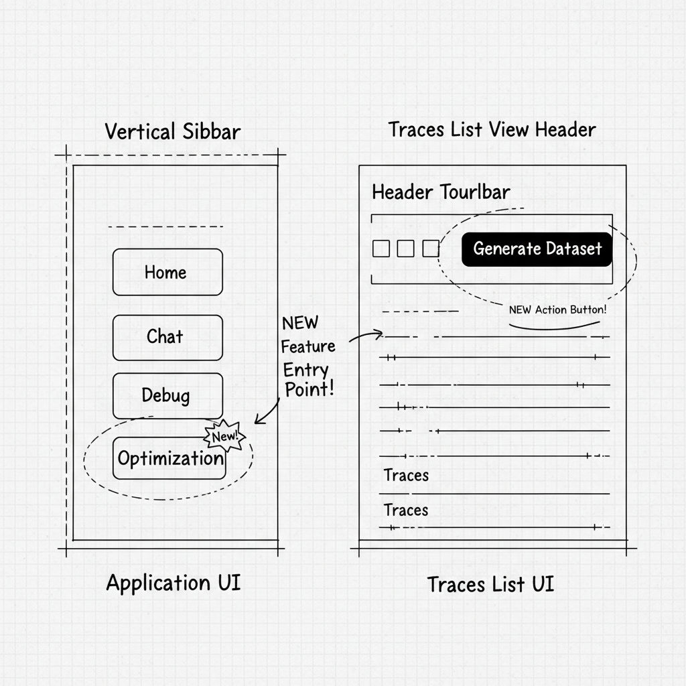
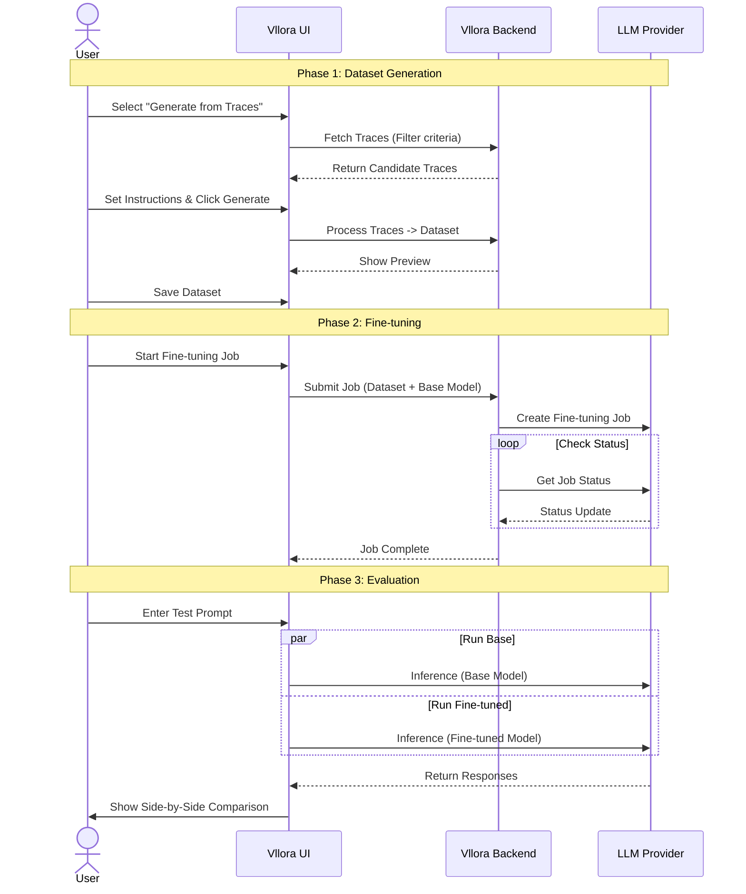

# Vllora Product Design Specification

This document consolidates the product analysis, current UI state, and the detailed design for the new **Model Optimization** feature.

---

## 1. Product Overview
**Vllora** (formerly Ellora) is a comprehensive **AI Gateway Web Interface** designed to unify how developers interact with, explore, and debug various AI models. It serves as a central hub for managing AI interactions across multiple providers (like OpenAI, Anthropic, Google, and local models).

### Core Functionality
*   **Unified Chat Interface**: A polished chat UI supporting nested conversations (threads), markdown, and real-time streaming.
*   **Model Exploration**: A marketplace-style "Browse Models" page to discover and compare models from different providers.
*   **Observability (Traces)**: Detailed logging of every interaction, including cost, latency, and token usage.
*   **Provider Management**: Secure management of API keys for multiple AI providers.

---

## 2. Current UI State

### Home Page (Dashboard)
The central hub for navigation, featuring Quick Links, Provider Status, and Top Models.

### Chat Interface
The core workspace featuring a unique **hierarchical threading** model for complex conversations.

---

## 3. New Feature: Model Optimization

### Goal
Enable users to leverage their existing application traces to create high-quality datasets for model fine-tuning, optimizing performance and cost.

### Entry Points
Where users access the feature:
1.  **Sidebar**: New "Optimization" tab.
2.  **Traces Page**: Contextual "Generate Dataset" button.
3.  **Span Detail**: New "Experiment" button to open the trace in a playground.

### Experiment / Playground Feature
**Goal**: Allow users to take a specific trace (request/response), modify the prompt or parameters, and re-run it to see how the output changes. This is crucial for debugging bad responses or testing prompt improvements.

**User Flow**:
1.  **View Trace**: User inspects a trace in the "Debug" view.
2.  **Click Experiment**: User clicks the "Experiment" button in the span detail panel.
3.  **Playground**: The app navigates to the **Experiment Page**, loading the **full conversation history**:
    *   Multiple System Prompts (e.g., main prompt + context injections).
    *   Full User/Assistant message history.
    *   **Multimodal Support**: Ability to attach images to User messages (for vision models).
    *   **Custom Headers**: Ability to add/edit custom HTTP headers (e.g., for auth or routing) passed to the model provider.
    *   **Tools / Functions**: A dedicated section to view and edit the function definitions (JSON schemas) available to the model.
    *   **Tools / Functions**: A dedicated section to view and edit the function definitions (JSON schemas) available to the model.
    *   **Dynamic Parameters**: A configuration panel that updates based on the selected model (e.g., showing `top_k` for Anthropic but not OpenAI, handling different max token limits).
4.  **Iterate**: User can **edit any message**, add new messages, or change the order.
5.  **JSON Mode**: Advanced users can switch to a **JSON Editor** view to modify the raw request body directly (useful for tweaking specific API parameters or debugging payload structure).
6.  **Run**: User clicks "Run" to generate a response for the last turn.
7.  **Compare & Trace**: The new output is shown side-by-side with the original. Users can also toggle a **Hierarchical Span View** to inspect the internal execution steps (e.g., tool calls, retrievals) of the new run.
8.  **Continue**: If satisfied, the user can click **"Continue with this response"** to append the new assistant message to the history and start a new user turn (multi-turn iteration).

### End-to-End User Journey

**Scenario**: Alice wants to fine-tune a model to be more concise for her coding assistant.

1.  **Dataset Generation**:
    *   Alice goes to **Optimization > Dataset Generator**.
    *   She filters traces for "React" and "Positive Feedback".
    *   She sets instructions: "Be concise, code only."
    *   System generates a dataset from her traces.
2.  **Fine-tuning**:
    *   Alice starts a new job in **Optimization > Fine-tuning**.
    *   She selects her new dataset and the base model (`gpt-3.5-turbo`).
    *   She starts the training job.
3.  **Evaluation**:
    *   Once complete, she uses the **Evaluation View** to compare the base model vs. her new fine-tuned model side-by-side.
    *   She confirms the new model is better and deploys it.

### Interaction Flow

### UI Designs

#### Dataset Generator
Interface for filtering traces and configuring dataset generation.

#### Fine-tuning & Evaluation Dashboard
Interface for managing jobs and comparing model outputs.

---

## 4. Competitor Analysis & Inspiration

The design of the Model Optimization feature is inspired by best-in-class LLMOps tools.

### 1. LangSmith (by LangChain)
*   **Inspiration**: The "Contextual Entry Point".
*   **Feature**: Allows users to click "Add to Dataset" directly from a trace view.
*   **Vllora Adoption**: We implemented the "Generate Dataset" button in the Traces toolbar.

### 2. HumanLoop
*   **Inspiration**: The "End-to-End Workflow".
*   **Feature**: Seamless transition from filtering logs (e.g., by positive feedback) to starting a fine-tuning job.
*   **Vllora Adoption**: Our "Dataset Generator" wizard allows filtering by feedback/tags before generation.

### 3. Arize Phoenix
*   **Inspiration**: "Auto-Detection".
*   **Feature**: Uses clustering to find patterns in traces.
*   **Vllora Adoption**: Our "Auto-Detect Vibe" feature helps users understand what kind of dataset they are creating.
